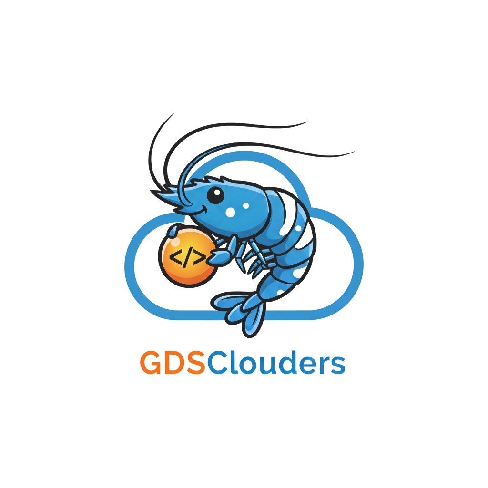

  

    
  

  

    <h1>GDSClouders Resource Center</h1>
  

## About Us
We are the **Center of Excellence (CoE)** at **[GD Services](https://www.gdservices.tech/)** a cross-functional team of platform engineers, devops engineers and solution architects. 

Our purpose is simple: help product teams ship reliable, secure, and scalable solutions faster, with less toil and more confidence.

### Our Mission
Raise the engineering bar across [GD Services](https://www.gdservices.tech/) by turning proven practices into reusable building blocks—so teams can focus on delivering customer value, not re-inventing the basics.

### What We Do
- **Reference Architectures:** Cloud-ready blueprints for networking, data, observability, CI/CD, and security.
- **Reusable Modules & Templates:** Infrastructure-as-Code, Helm charts, and pipelines with sensible defaults.
- **Guides & Enablement:** Design reviews, workshops, and office hours to unblock teams quickly.
- **Operational Guardrails:** Secure-by-default standards, checklists, and runbooks that scale.

### How We Work
- **Open by default:** We share patterns, decisions, and code where everyone can learn and contribute.
- **Automation first:** Repeatable tasks are scripted, versioned, and auditable.
- **Security built-in:** Controls are integrated from day one—not bolted on later.
- **Outcome driven:** We track impact (lead time, change failure rate, reliability) to guide improvements.

### Who We Serve
Product teams across [GD Services](https://www.gdservices.tech/) that want a clear, paved path—from idea to production—backed by best practices and hands-on support.

### Get Involved
- Explore our standards and starters in this site/repo.
- Request a design review or enablement session.
- Contribute improvements via issues and pull requests.