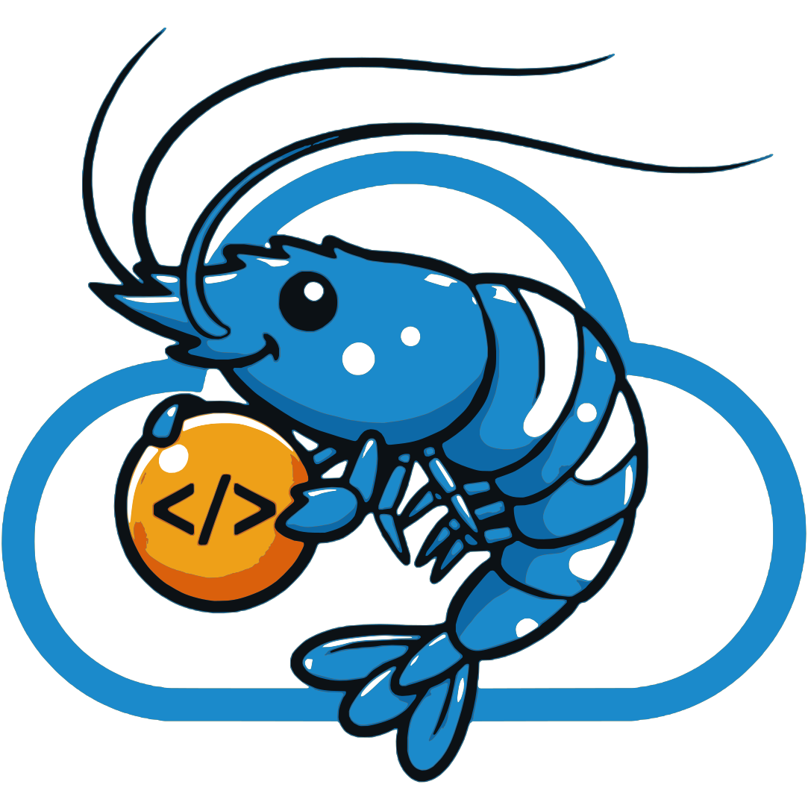

  

    
  

  

    <h1><b>GDSClouders Resource Center</b></h1>
  

## [About Us](./about-us.md)
**We are the Center of Excellence (CoE) at [GD Services](https://www.gdservices.tech/) a cross-functional team of platform engineers, devops engineers and solution architects. Our purpose is simple: help product teams ship reliable, secure, and scalable solutions faster, with less toil and more confidence.**

## [Meet Camila!](./camila.md)
**Camila, our mascot, is an agile, meticulous, and fundamental creature for her own ecosystem, immersed in the cloud. She's the visual embodiment of GDSClouders' philosophy and its approach to innovation and technology infrastructure management.**

# Welcome onboard! 
## Heres the basic GDSClouders Resources

## Collaboration
- [Cryptpad](https://cryptpad.fr) -- **Office Suite and Document sharing**
- [Discord](https://discord.com) -- **Chat, Sharing, Meetings**
- [Taiga](https://tree.taiga.io) -- **Project Management, Tracking activities**
- [GitHub](https://github.com/GDSClouders) -- **Our official GitHub Organization**

## Tools

- [Age](https://github.com/FiloSottile/age) -- **age is a simple, modern and secure file encryption tool, format, and Go library.**
- [k9s](https://k9scli.io) -- **Kubernetes CLI To Manage Your Clusters In Style!**
- [wireguard](https://www.wireguard.com) -- **WireGuard® is an extremely simple yet fast and modern VPN that utilizes state-of-the-art cryptography**
- [VsCode](https://code.visualstudio.com) -- **The open source AI code editor**
- [kubectl](https://kubernetes.io/docs/tasks/tools/install-kubectl-linux) -- **The Kubernetes command-line tool**

## General Guidelines
**We welcome any operating system of your choice, as long as it’s up to date and meets today’s security standards. What matters most is that you feel comfortable with the system you’re using. Please note that support and compatibility with our tools will rely on the shared knowledge and collaboration among our team members.**
- [Our Learning Vision](./learning-vision.md) -- **We are a continuously learning company. We don’t chase hype; we stay current by researching, experimenting, and mastering what truly matters so we can deliver with confidence.**